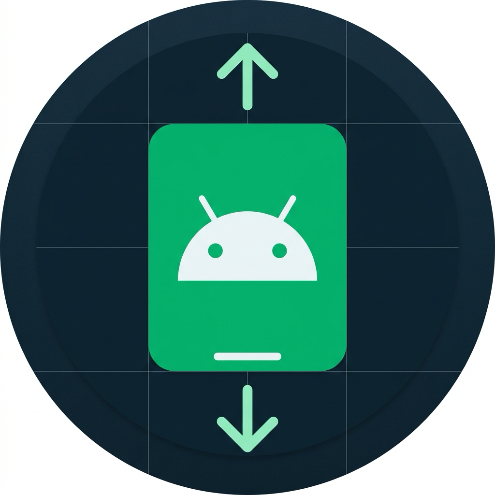

<div align="center">



# Edgefitter

> *Formerly **SystemBarsModernizer***

**让 Android 应用拥抱真·边到边（Edge-to-Edge）现代化系统栏体验**

[](https://www.android.com)
[-brightgreen.svg?style=flat-square)](https://android-arsenal.com/api?level=29)
[](https://github.com/libxposed/api)
[](https://kotlinlang.org)
[](LICENSE)

[English](#features) • [简体中文](#-项目简介) • [配置文档](#-规则配置与-extraaction-引擎) • [免责声明](#️-免责声明-disclaimer)

---

</div>

## 📖 项目简介

在现代 Android 系统（特别是 Android 10+ 的手势导航时代）中，许多第三方应用依然保留着传统的黑底导航栏、生硬的状态栏垫高（Padding）或者自定义的底部占位 View（如 72px 导航占位条），破坏了全面屏的无缝视觉体验。

**Edgefitter**（曾用名 *SystemBarsModernizer*）是一个基于现代化 **LibXposed (API 102)** 标准构建的高性能 Xposed 模块。它通过在系统框架层与视图层进行精准拦截与参数改写，为各类应用强制启用 **Edge-to-Edge 边到边渲染**，并提供细粒度的布局边距矫正引擎，彻底消除黑条、切边与多余垫高。

### 💡 名字的由来与设计哲学（Why "Edgefitter"?）

> *“Stay on the edge. Fit to perfection.” —— 游走边界，极致贴合。*

* **🔄 初心与演进（From Modernizer to Fitter）**：
  项目原名 **SystemBarsModernizer**，寓意直白清晰——*“Modernize your system bars”*（让系统栏迈向现代化），旨在终结老旧应用在状态栏与导航栏上的割裂与陈旧渲染。随着架构演进，模块不仅实现了宏观的现代化改造，更沉淀出强大的细粒度布局矫正引擎与鲜明的极客态度，因而正式更名为 **Edgefitter**。
* **⚡ 赛博朋克文化隐喻**：
  名字灵感与构词致敬《赛博朋克：边缘行者》（*Cyberpunk: Edgerunners*）。遵循赛博朋克世界观中将复合词融为专有名词的构词习惯（如 *Netrunner*、*Edgerunner*），**Edgefitter** 采用小写 `f` 作为一个浑然一体的极客身份代号。正如游走在夜之城规则边缘的行者，作为底层模块，它游走在 Android 视图系统与 Framework 的边界，打破旧框架与陈旧布局的桎梏。
* **🎯 功能与动作的精准双关**：
  - **Edge**：承袭现代化系统栏体验的使命，直指 **Edge-to-Edge（真·边到边）** 与全面屏边界；
  - **Fitter**：直击模块核心——不仅是一键开关，更像一位精密的**边缘装配工 / 拟合者**，通过 `ExtraAction` 引擎对 Insets、Padding 与 Margin 开展细粒度微调与矫正，让每个界面与系统栏严丝合缝。
* **📱 桌面排版与视觉体验**：
  相较于原名 *SystemBarsModernizer*（20 字符），*Edgefitter*（10 字符）更加干练利落，在 Android 桌面启动器及 LSPosed 模块列表中彻底告别文字省略号截断。

---

## ✨ 核心特性

- 🚀 **全面适配现代 LibXposed API 102**：
  采用现代化的无侵入 Xposed 架构，支持 `onPackageReady`、`onHotReloading` / `onHotReloaded` 生命周期管理与 RemotePreferences 配置共享。
- 🎨 **真·边到边（Edge-to-Edge）**：
  强制解锁系统栏透明底色，关闭 Android 系统的深色对比度遮罩（`isStatusBarContrastEnforced / isNavigationBarContrastEnforced = false`），并支持自动根据背景亮度适配亮/暗色状态栏与导航手势条。
- 🛠️ **强大的 ExtraAction 布局矫正引擎**：
  - **Padding（内边距）矫正**：动态重置或注入顶部状态栏/底部导航栏 Insets；
  - **Margin（外边距）矫正**：动态拦截 `View.setLayoutParams`，精准改写子容器的 `topMargin` / `bottomMargin`；
  - **占位 View 消除（`isGone`）**：锁定指定占位 View 为 `View.GONE` 且高度归零；
  - **DecorView 索引定位（`viewId = "decor"`）**：支持定位未命名的 DecorView 子容器（如 `decorView.getChildAt(0)`）。
- 🔍 **4 级智能页面匹配体系**：
  1. **精确类名匹配**：`scope["com.example.MainActivity"]`
  2. **`$` 内部类/影子 Activity 向上继承**：`SubActivity$Child01` 自动继承 `SubActivity` 的规则
  3. **`*` 前缀通配符批量匹配**：`"com.example.feature.ui.*"`
  4. **通用兜底规则与排除列表（`exclusive`）**
- ⚡ **极致性能与零开销架构**：
  - `WeakHashMap<Activity, PageConfig?>` 弱引用缓存，页面配置 O(1) 内存直取；
  - Fast-Path 短路机制：非目标页面与普通 View 在第 1 行指令直接放行，**单次排版拦截仅需 ~26ns**；
  - 120Hz/144Hz 高刷设备丝滑满帧，零掉帧与零内存泄露。
---

## 🏗️ 工作原理与架构

```
┌─────────────────────────────────────────────────────────────┐
│                      Android 进程启动                        │
└──────────────────────────────┬──────────────────────────────┘
                               │
                ┌──────────────▼──────────────┐
                │ onPackageReady (LibXposed)  │
                └──────────────┬──────────────┘
                               │ 读取 RemotePreferences
                               │
            ┌──────────────────┼──────────────────┐
            │                  │                  │
  ┌─────────▼────────┐ ┌───────▼────────┐ ┌───────▼────────┐
  │ Activity.onCreate│ │ View.setPadding│ │ setLayoutParams│
  └─────────┬────────┘ └───────┬────────┘ └───────┬────────┘
            │                  │                  │
   设置 Window 边到边     Fast-Path 短路    Fast-Path 短路
   注入系统透明栏颜色     执行 Padding 改写  执行 Margin 改写
            │                  │                  │
            └──────────────────┴──────────────────┘
```

---

## ⚙️ 规则配置与 ExtraAction 引擎

Edgefitter 采用结构化的数据模型描述每个应用和页面的边到边行为：

### 1. `PageConfig` 结构说明

```kotlin
data class PageConfig(
    val edgeToEdge: Boolean = false,          // 是否启用全屏边到边
    val clearTranslucent: Boolean = false,     // 是否清除半透明 Window 标记
    val windowBackgroundColor: Int? = null,    // 强制设置 Window 背景颜色
    val statusColor: Int = Color.TRANSPARENT,   // 状态栏颜色
    val navigationColor: Int = Color.TRANSPARENT, // 导航栏颜色
    val extraActions: List<ExtraAction> = emptyList(), // 额外的布局矫正动作
    val uiModeWBC: Pair<Int, Int>? = null      // 深色/浅色模式下的背景色自动切换
)
```

### 2. `ExtraAction` 结构与典型场景

```kotlin
data class ExtraAction(
    val viewId: String,               // 目标 View ID（如 "decor"、"content" 或具体 R.id 名称）
    val isGroup: Boolean = false,      // 是否作为 ViewGroup 查找子 View
    val isTop: Boolean = false,        // 针对顶部（状态栏）还是底部（导航栏）
    val isPadding: Boolean = true,     // true 表示修改 Padding，false 表示修改 Margin
    val useSystemInsets: Boolean = false, // 是否自动使用系统栏高度作为边距
    val customInset: Int = -1,         // 自定义边距像素值（设为 0 即清空边距）
    val self: Boolean = true,          // 是否作用于自身（false 则作用于 childIndex 对应子 View）
    val childIndex: Int = -1,          // 目标子 View 索引（如 0）
    val isGone: Boolean = false,       // 是否强制设为 View.GONE 消除占位 View
    val delay: Long = 100L,            // 动作执行延迟时间（毫秒，默认 100ms）
    val routes: List<String> = emptyList(), // 路由过滤关键字列表（支持匹配 Intent 中的 url/data）
    val isRouteExclusive: Boolean = false   // 路由过滤模式（true 为黑名单排除模式，false 为白名单包含模式）
)
```

#### 常见额外动作配置范式：

- **场景 1：清空特定容器 View 的底部 Padding（解决 Web/Hybrid 容器底部留白）**
  ```kotlin
  ExtraAction(viewId = "web_root_container", isTop = false, isPadding = true, customInset = 0)
  ```
- **场景 2：清空 DecorView 第 1 个子容器的底部 Margin（解决多层容器嵌套下的黑底）**
  ```kotlin
  ExtraAction(viewId = "decor", isGroup = true, self = false, childIndex = 0, isTop = false, isPadding = false, customInset = 0)
  ```
- **场景 3：隐藏硬编码的导航栏占位 View（解决底部多余的空白占位条）**
  ```kotlin
  ExtraAction(viewId = "nav_placeholder_view", isGone = true)
  ```
- **场景 4：裁剪隐藏底部导航栏的无用 Tab（实现底栏功能净化与自适应均分）**
  ```kotlin
  // 查找底栏 ViewGroup（如 "tabs"），将其第 2 个子 Tab 设为 GONE，剩余 Tab 自动均分平铺
  ExtraAction(viewId = "tabs", isGroup = true, self = false, childIndex = 1, isGone = true)
  ```
- **场景 5：针对异步渲染/慢加载视图的延迟动作**
  ```kotlin
  // 针对网络返回后才动态插入的容器，设置 500ms 延迟后精准执行
  ExtraAction(viewId = "bottom_floating_bar", isGone = true, delay = 500L)
  ```
- **场景 6：混合框架（如 FlutterBoost）基于 Intent 路由黑/白名单过滤**
  ```kotlin
  // 针对通用容器 Activity，清空列表页的 Margin，但排除聊天等带底栏的路由页面
  ExtraAction(
      viewId = "decor", isGroup = true, self = false, childIndex = 0,
      isTop = false, isPadding = false, customInset = 0,
      routes = listOf("x_chat"), isRouteExclusive = true
  )
  ```

---

## 🌐 系统版本兼容性与演进矩阵 (Compatibility Matrix)

为了消除不同 Android 系统版本（从 Android 10 到 Android 15+）以及不同应用目标 API（Target SDK）之间的渲染割裂，Edgefitter 采用**窗口级系统栏接管**与**视图级动态拦截**双层兼容架构。

### 1. 窗口与系统栏命令（Window Level）兼容性

| 命令 / 操作 | Android 10 ~ 14<br>(主流环境) | Android 15+<br>(App Target &lt; 35) | Android 15+<br>(App Target &ge; 35) | 机制说明 |
| :--- | :---: | :---: | :---: | :--- |
| **`WindowCompat.setDecorFitsSystemWindows(window, false)`** | 🌟 **强力生效** | 🌟 **强力生效** | 🌟 **系统默认开启** | 拓宽整个 Window 内容区域延伸至屏幕顶底极限（边到边）。 |
| **`statusBarColor = TRANSPARENT`<br>`navigationBarColor = TRANSPARENT`** | 🌟 **强力生效** | 🌟 **强力生效** | 🌟 **系统强制透明** | 将系统栏背景色设为全透明，彻底消除传统黑条。 |
| **`isNavigationBarContrastEnforced = false`** | 🔥 **核心关键点** | 🔥 **核心关键点** | 🌟 **系统默认关闭** | 撕掉 Android 10+ 浅色模式下底层强加的 80% 灰黑色系统遮罩（Scrim）。 |
| **`layoutInDisplayCutoutMode = ALWAYS`** | 🌟 **强力生效** | 🌟 **强力生效** | 🌟 **强力生效** | 确保横竖屏切换时内容区域均能贯穿挖孔屏/刘海区域。 |

> [!NOTE]
> 从 Android 15 (API 35) 开始，Google 将 `setStatusBarColor` 与 `setNavigationBarContrastEnforced` 等标记为 Deprecated，并在系统底层强制推行全透明边到边。由于 Edgefitter 注入的正是 `Color.TRANSPARENT` 与 `isContrastEnforced = false`，因此在 Android 15 + Target 35 下模块行为与系统原生规范 **100% 吻合**，且在 Android 10~14 上依然是消除系统灰色遮罩的必要手段。

### 2. 视图与拦截器命令（View Level - 核心护城河）

| 拦截器 / 动作 | 涉及机制与 Hook | 在所有 Android 版本 & 所有 Target SDK 的有效性 |
| :--- | :--- | :---: |
| **Padding 动态矫正** | `View.setPadding` / `setPaddingRelative` | 💯 **100% 永久有效** |
| **Margin 参数改写** | `View.setLayoutParams` (`MarginLayoutParams`) | 💯 **100% 永久有效** |
| **占位 View 抹除** | `View.setVisibility` (`ExtraAction.isGone`) | 💯 **100% 永久有效** |
| **DecorView 索引定位** | `decorView.getChildAt(index)` | 💯 **100% 永久有效** |

> [!TIP]
> **为什么视图级命令在 Android 15 上依然不可替代？**
> Android 15 的系统边到边升级仅解决了**系统窗口的外层贴边**，无法解决第三方 App 内部写死的内部逻辑（如特定业务容器加的 `bottomMargin`、72px 导航占位 View、Web/Hybrid 容器写死的内部 Padding 垫高）。Edgefitter 的视图级拦截引擎在任何 Android 版本下都是抹平第三方应用内部排版缺陷的终极手段。

---

## 🗺️ 路线图与规划（Roadmap & TODO）

目前 Edgefitter 的核心 Hook 引擎与管理端 App（包含可视化应用列表、多层级规则编辑器、实时框架状态看板、本地配置导入导出及双语本地化）均已完整构建就绪：

- [x] **应用列表可视化（App List）**：
  - [x] 扫描并展示设备上已安装的全部第三方与系统应用，支持多维度过滤（全部/已配置/用户/系统）；
  - [x] 异步加载应用图标、名称、包名与规则配置状态；
  - [x] 采用 Room 数据库 + MVVM + DiffUtil 极速流畅渲染与实时搜索。
- [x] **可视化规则动态编辑器（Rule Editor & CRUD）**：
  - [x] 支持按应用查看与精细化管理全局规则（GeneralConfig）、排除页面（exclusive）及专属页面规则（PageConfig）；
  - [x] ExtraAction 动作可视化配置：Padding/Margin 改写、系统 Insets 注入、占位 View 隐藏（`isGone`）与 DecorView 索引定位；
  - [x] Activity 智能选择器（支持已声明 Activity 列表读取与 `*` 通配符/自定义类名输入）。
- [x] **配置实时热同步（Sync to LSPosed / Hook Engine）**：
  - [x] 规则保存后动态写入并推送至 `RemotePreferences`；
  - [x] 配合 LibXposed API 102 热重载与进程就绪通知，目标应用前后台切换即刻热生效；
  - [x] 提供设置页一键“强制同步规则”能力。
- [x] **概览与框架状态监控（Overview Dashboard）**：
  - [x] 实时探测 LibXposed 激活状态与模块挂载连通性；
  - [x] 规则应用数、全局 E2E 启用数与 ExtraAction 动作总数可视化统计；
  - [x] 快捷查看当前生效的作用域应用列表（Scope Dialog）。
- [x] **本地配置备份与多语言本地化**：
  - [x] 规则配置全量 JSON 导出与安全导入备份（ConfigsBackup）；
  - [x] 完整的双语本地化支持（简体中文 `zh-CN` / 英文 `en`）；
  - [x] 现代自适应应用图标与 Android 13+ 动态主题取色图标（Themed Icon）。
- [ ] **规则云端订阅与社区生态**：
  - [ ] 规则云端订阅源支持，一键拉取并合并社区热门应用适配规则池；
  - [ ] 规则在线分享与冲突智能合并（Merge）。
- [ ] **进阶调试与辅助工具（In-App Inspector）**：
  - [ ] 目标应用内悬浮 View 树抓取与定位辅助工具，一键生成对应 ExtraAction。
- [ ] **Flutter / 跨端混合框架 Insets 拦截与矫正**：
  - [ ] 针对 Flutter / FlutterBoost 等自绘引擎，Hook `FlutterJNI.setViewportMetrics` 与 `FlutterView.onApplyWindowInsets`，改写底层 ViewportMetrics 边距，实现跨端页面内部 SafeArea / 底部系统栏占位的高级消除。

---

## 🚀 安装与使用

### 环境要求
- **Android 版本**：Android 10.0 (API 29) 及以上
- **框架支持**：LSPosed (推荐最新版本) 或支持 LibXposed 的现代 Xposed 环境

### 使用步骤
1. 在 [Releases](../../releases) 中下载最新的 APK 并安装；
2. 打开 LSPosed 管理器，在模块列表中勾选 **Edgefitter** 并启用；
3. 选择需要生效的目标应用作用域；
4. 强行停止目标应用后重新打开，即可享受丝滑的边到边体验。

---

## 🛠️ 源码构建

本项目采用标准 Gradle 构建系统：

```bash
# 1. 克隆本仓库
git clone https://github.com/Hal1ucinogen/SystemBarsModernizer.git
cd SystemBarsModernizer

# 2. 编译 Debug 版本 APK
./gradlew assembleDebug

# 3. 编译 Release 版本 APK
./gradlew assembleRelease
```

构建生成的 APK 位于：
* `app/build/outputs/apk/debug/app-debug.apk`
* `app/build/outputs/apk/release/app-release-unsigned.apk`

---

## ⚠️ 免责声明 (Disclaimer)

1. **用途限制**：本项目（Edgefitter，曾用名 *SystemBarsModernizer*）仅用于 Android 视图系统（View System）与边到边（Edge-to-Edge）渲染技术的学习、研究与个人视觉体验优化。
2. **实现原理**：本项目仅在用户已取得 Root/框架授权的本地设备内存（RAM）中，通过公开的系统视图接口对视图边距和系统栏颜色进行运行时局部调整。**本项目不包含任何破解、反编译、逆向工程或重新分发第三方应用程序 APK 原文件的行为，亦不篡改任何应用程序的业务逻辑、数据通信与安全机制。**
3. **商标与版权**：文档与代码中提及的所有第三方应用名称、包名及商标，其知识产权与商标权均归其各自的合法所有者所有，仅作为兼容性技术参考，与本项目作者无任何商业关联。
4. **使用风险**：用户需自行承担使用 Xposed 模块的相关风险，作者不对因使用本软件造成的任何直接或间接影响承担法律责任。

---

## 🤝 贡献与反馈

欢迎提交 Issue 和 Pull Request！
- 如果你发现了某个 App 在启用后出现界面被遮挡、黑底未能消除或视图错位；
- 欢迎通过 Logcat 抓取 View 层级并提交新的 `ExtraAction` 适配规则。

---

## 📄 开源协议

本项目基于 [Apache License 2.0](LICENSE) 开源。
